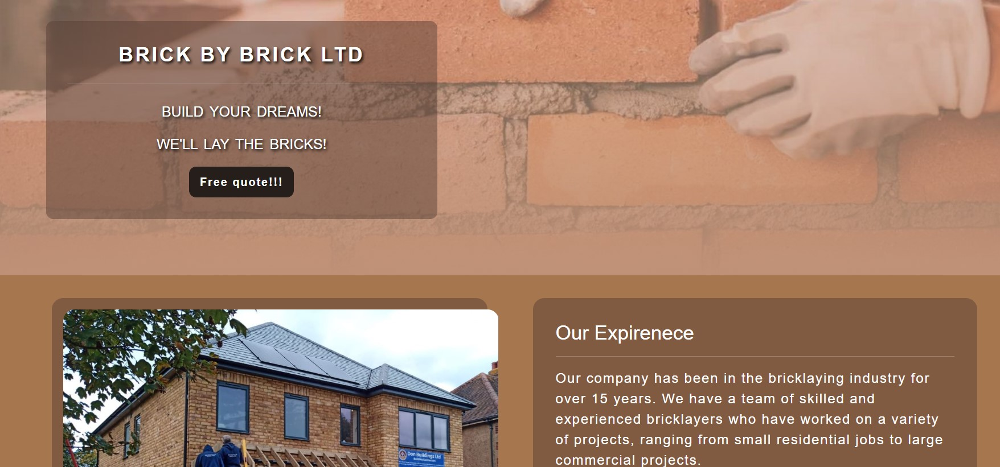

<h1 align="center">Brick By brick Website</h1>

[View the live project here.](https://erikas-ramanauskas.github.io/Milestone-Project-1/)

This is a website for the "Brick by brick" bricklayer company. It is created to be responsible on all range of devices informing any visitor of what the companies services and goals are as well as helping to find new clients

<h2 align="center"></h2>

   

## CONTENTS

- [User Experience](#user-experience)

  - [Main idea](#main-idea)
  - [User stories](#user-stories)
    - [First Time Visitor Goals](#first-time-visitor-goals)
    - [Returning Visitor Goals](#returning-visitor-goals)
    - [Frequent User Goals](#frequent-user-goals)

- [Design](#design)
  - [Colour Scheme](#colour-scheme)
  - [Typography](#typography)
  - [Imagery](#imagery)
  - [Imagery](#imagery)
- [Wireframes](#wireframes)
- [Features](#features)
  - [Header / Footer](#header-&-footer)
  - [Home page](#home-page)
  - [About us page](#about-us-page)
  - [Galery page](#galery-page)
  - [Contact page](#contact-page)
- [Technologies Used](#technologies-used)
  - [Languages Used](#languages-used)
  - [Frameworks, Libraries & Programs Used](#frameworks,-libraries-&-programs-used)
- [Testing](#testing)
  - [Further Testing](#further-testing)
  - [Solved Bugs](#solved-bugs)
  - [Known Bugs](#known-bugs)
- [Posible Improvements](#posible-improvements)
- [Deployment](#deployment)
  - [GitHub Pages](#github-pages)
  - [Forking the GitHub Repository](#forking-the-github-repository)
  - [Making a Local Clone](#making-a-local-clone)
- [Credits](#credits)
  - [Before the course](#before-the-course)
  - [Code](#code)
  - [Content](#content)
  - [Media](#media)
  - [Acknowledgements](#acknowledgements)

## User Experience

- ### Main idea

Brick By Brick is a website for a team of bricklayers who specializes in brickwork based around London. The purpose of the website is to inform of the services the team provides as well as capture potential leads quickly.

The goal of each section is to answer the main questions:

- Team experience
- Team vision
- Past projects
- What they can offer.
- How to find them and contact them

- ### User stories

- #### First-Time Visitor Goals

1. Understand clearly what the site is representing and able to offer.
2. Quickly find out what the team can offer.
3. Have multiple clear ways to contact the team.
4. Accses clear visible review section

- #### Returning Visitor Goals

1. I want to find out where are based and visit their showroom
2. Have easy and clear access to get more information about their past projects
3. I want to find social media links

- #### Frequent User Goals

- Frequent users would be a contractor who works with developers on daily basis and they would be recommending the company to regular clients. The main purpose is to have a clear Contact section

1.  Easy access to the team's profile and what they did in the past.
2.  Clear contact details and the form to fill in.
3.  Check up with Brick by Brick owners and have their projects added to a gallery.

## Design

- ### Colour Scheme

- 5 main colors used were created using [Adobe Color](https://color.adobe.com/create/color-wheel).

I used several brick pictures and played different shades to get a few darker colors that landed me on the following list:

```CSS
:root {
--primary-color: rgb(242, 211, 172);
--secondary-color: rgb(166, 119, 78);
--third-color: rgba(89, 64, 54, 0.5);
--shade-color: rgb(191, 146, 120);
--shadow-color: rgb(38, 30, 27);
}
```

  <h2 align="center"></h2>

I used variables to allow me in the future to change colors or add dark mode or other themes to the website. The text is made of white color mostly with added dark shadow where the text is directly on the picture for better visibility.

- ### Typography

- I used a mix of Roboto, Saira, and Archivo fonts

1.  Roboto is the main font I used for larger pieces of text. for the main section as well as the about us section

2.  Saira was used for contact details in a navigation bar

3.  Archivo was kept for Navigation links, Contact details, and Headers

- ### Imagery

- Head image is chosen to be a clear indication of what is the company about. It is full screen on every device and is only covered by the navigation bar and Hero-outer which are also semi-transparent. It is also made to be responsive and hide a part of the picture depending on the screen size yet keeping the main part of the picture (Hand with a brick) centered

- All other Imagery is chosen from real projects done by the company to represent realistic works done.

## Wireframes

- Home Page mobile - [View](assets/Images/Read-me/Iphone-12.png)

- Home Page tablet - [View](assets/Images/Read-me/Ipad-air.png)

- Home Page desktop - [View](assets/Images/Read-me/21-inch-screen.png)

## Features

- The website is combined of 4 pages: Home, About us, Galery and Contact us pages.

- ### Header & Footer

- All pages contain the same header and footer with navigation links. Apart from Home one has an extended header. I chose a picture that would not only clearly represent exactly what the company/website is about but also would have clear brick contrast behind a navigation bar as a client browses to other pages. Additionally, the colors of the picture allowed me to blend them in with the background and other chosen colors.

- Header contains svg logo that draws itself once the page is open, the title of the company, navigation bar for all 4 pages, and main contact lins: Phone and Email. This was implemented to have easy access for the user to all the important links and quick access to contacting the team for a consultation.

- Footer contains animation responsive 4 social media links for visitors to visit if they wish to check the social media of Brick by Brick.

- ### Home page

- The home page header picture is extended by 100% screen size height and contains an additional hero outer with a quick catchy summary of what the company does with a clear call to action button to fill in the form by the visitor.

- The main section consists of 4 parts. The three parts briefly explain what is a company about, and what services they offer and the last one is a customer review carousel for visitors to view recommendations. I have alternated background colors for each part to make them stand out from each other.

- ### About us page

- About us page consists of 2 parts. One is an explanation about the general Brick by Brick team and the second is individual member profiles. Each profile is made into a card with the picture at the top and text below.

- ### Galery page

- Gallery is consisting of a responsive picture layout of the Company's works. It is designed with the intent that with smaller screen sizes less of pictures are added per row and more pictures are when screen sizes get bigger.

- Additionally, user can scroll their mouse on each picture to have animation revealing the general location and the project done for that particular picture. For phones and tablets, this is done with a click on the picture

- ### Contact page

- contact page is designed for people who would like to get a quotation or directly contact the company themselves.
- With the first section of the row has the main ways to contact or visit including email, phone, and address. For people who would like to copy/paste the contact detail, I left those unclickable, however, the titles (Phone, Email, Location) are made with links and hover animation to allow both functionalities in the same section.

- Additional form is added as a second section for those who might have missed a home page with the same functionality just in different colors and hover effects.

- Lastly, google maps is added for people who would be looking to visit a showroom

## Technologies Used

- ### Languages Used

- [HTML5](https://en.wikipedia.org/wiki/HTML5)
- [CSS3](https://en.wikipedia.org/wiki/Cascading_Style_Sheets)

- ### Frameworks, Libraries & Programs Used

1.  [Bootstrap 5.3:](https://getbootstrap.com/docs/5.3/getting-started/introduction/)

- Used Bootstrap to add responses to a website and make sure it looks good on all screen sizes.

2.  [Google Fonts:](https://fonts.google.com/)

- Used to add custom fonts to the website.

3.  [Font Awesome:](https://fontawesome.com/)

- Used to add custom icons to enhance user experience and navigation

5.  [Visual Studio Code](https://code.visualstudio.com/)

- For the majority of programming and version control

7.  [Git](https://git-scm.com/)

- Git was used for version control by utilizing the Gitpod terminal to commit to Git and Push to GitHub.

8.  [GitHub:](https://github.com/)

- Used to store and publish the project to a web

9.  [Figma:](https://www.figma.com/)

- Figma was used to create the wireframes during the design process.

## Testing

- The W3C Markup Validator and W3C CSS Validator Services were used to validate every page of the project to ensure there were no syntax errors in the project.

- [W3C Markup Validator](https://validator.w3.org/) - [Results](https://github.com/)
- [W3C CSS Validator](https://jigsaw.w3.org/css-validator/) - [Results](https://github.com/)

- Additionally tested the website on chrome lighthouse to ensure that 4 categories: Performance, Accessibility, Best practices, and SEO are to the highest standards.

The test was done for all 4 pages using the mobile setup:

1.  Home page:
<h2 align="center"></h2>

2.  About-us page:
<h2 align="center"></h2>

3.  Galery page:
<h2 align="center"></h2>

4.  Contact page:
<h2 align="center"></h2>

- [Chrome Lighthouse](https://developer.chrome.com/docs/lighthouse/overview/)- [Results](https://github.com/)

### Further Testing

- The Website was tested on Google Chrome, Internet Explorer, Microsoft Edge, Firefox, and Safari browsers on multiple computers.

- The website was viewed on a variety of devices such as Desktop, Laptop, iPhone 12, iPhone 14 ProMax & Sony Xperia 5

- All the links were tested multiple times during the coding and final testing once a project is completed. All navigation links open up within the same window. All external links open a new window (Including Contact details in the navigation bar and on the contact page, as well as social media links)

- Friends and family members were asked to review the site and documentation to point out any bugs and/or user experience issues.

### Solved Bugs

1.  Navigation bar would go out of the screen when testing on the smaller devices when I introduced phone and email into it. The workaround is that I split both navigation menus and contacts into separate unordered lists as child elements of the bigger unordered list. This way I managed to place these groups in 2 lines when smaller screens are introduced (tablets and such) and once it goes to an even smaller screen everything would go to hamburger.

2.  solving the first problem caused a bug that made the navigation bar hamburger on small screens to be opened once you first load the pages. This was solved by adding back the "collapse" class next to "navbar-collapse"

3.  There were multiple issues with screen sizes for all of the main sections during the beginning of coding. It took me some research and rewatching code institute lessons to learn the proper use of "col" and "row" classes with inserted different breakpoints. The easiest was the gallery as all control was done in the "Row" class, unlike the main page I controlled responsiveness by manipulating the "col" class

4.  Main page carousel Descriptions were overlapped on the smaller screen sizes, I have reduced the font for smaller screen sizes and hidden parts of the text by leaving the Main title and reference.

5.  With a form I made a mistake by not putting a "name" tag and it was not capturing data correctly missing an email and full name.

6.  One of the bugs I received help with from my mentor was that I was pathing my images wrong using CSS background-image property and not adding .. to return to the images folder since the CSS file was placed in a different folder compared to HTML. This caused the hero image not to be visible.

### Known Bugs

- Gallery section: when hovering the mouse over or clicking with the touchpad during the animation for a split second bottom part of the picture corners loses radius around. This is due to another div appearing on top and sliding from the bottom that later aligns with the main div. Anyone I tested out and asked even to look for the issue did not notice this. Yet I could not find a solution around it apart from simply removing the border-radius entirely.

## Posible Improvements

- Main page carousel buttons are hard to adjust, so I would like to make them thicker. In the future with enough knowledge I would make a carousel that I have a bit more control over.

- I would like gallery pictures to be clickable to expand full size or around 90% and be able to flick through as a carousel.

- Additionally "Blog" section could be added to add custom user stories with before and after pictures.

## Deployment

### GitHub Pages

The project was deployed to GitHub Pages using the following steps...

1.  Log in to GitHub and locate the [GitHub Repository](https://github.com/Erikas-Ramanauskas/Milestone-Project-1)
2.  At the top of the Repository (not the top of the page), locate the "Settings" Button on the menu.

- Alternatively, Click [Here](https://raw.githubusercontent.com/) for a GIF demonstrating the process starting from Step 2.

3.  Scroll down the Settings page until you locate the "GitHub Pages" Section.
4.  Under "Source", click the dropdown called "None" and select "Master Branch".
5.  The page will automatically refresh.
6.  Scroll back down through the page to locate the now-published site [link](https://erikas-ramanauskas.github.io/Milestone-Project-1/) in the "GitHub Pages" section.

### Forking the GitHub Repository

By forking the GitHub Repository we make a copy of the original repository on our GitHub account to view and/or make changes without affecting the original repository by using the following steps...

1.  Log in to GitHub and locate the [GitHub Repository](https://github.com/Erikas-Ramanauskas/Milestone-Project-1)
2.  At the top of the Repository (not the top of the page) just above the "Settings" Button on the menu, locate the "Fork" Button.
3.  You should now have a copy of the original repository in your GitHub account.

### Making a Local Clone

1.  Log in to GitHub and locate the [GitHub Repository](https://github.com/Erikas-Ramanauskas/Milestone-Project-1)
2.  Under the repository name, click "Clone or download".
3.  To clone the repository using HTTPS, under "Clone with HTTPS", copy the link.
4.  Open Git Bash
5.  Change the current working directory to the location where you want the cloned directory to be made.
6.  Type `git clone`, and then paste the URL you copied in Step 3.

```
$ git clone https://github.com/YOUR-USERNAME/YOUR-REPOSITORY
```

7.  Press Enter. Your local clone will be created.

```
$ git clone https://github.com/YOUR-USERNAME/YOUR-REPOSITORY
> Cloning into `CI-Clone`...
> remote: Counting objects: 10, done.
> remote: Compressing objects: 100% (8/8), done.
> remote: Total 10 (delta 1), reused 10 (delta 1)
> Unpacking objects: 100% (10/10), done.
```

Click [Here](https://help.github.com/en/github/creating-cloning-and-archiving-repositories/cloning-a-repository#cloning-a-repository-to-github-desktop) to retrieve pictures for some of the buttons and more detailed explanations of the above process.

## Credits

### Before the course

- Before the course, I was self-learning HTML, CSS, and Javascript from multiple sources thus I had some basic knowledge and references to different websites or sources for different ideas for the project that I will mention below.

### Code

- The full-screen hero image code came from this [Adobe Stock](https://stock.adobe.com/uk/images/id/117356918?clickref=1011lwvzCN3L&mv=affiliate&mv2=pz&as_camptype=&as_channel=affiliate&as_source=partnerize&as_campaign=wbm)

- [Bootstrap4](https://getbootstrap.com/docs/5.3/getting-started/introduction/): Bootstrap Library used throughout the project mainly to make site responsive using the Bootstrap Grid System.

- With bootstrap, a lot of help came from [Web Dev Simplified](https://www.youtube.com/watch?v=Jyvffr3aCp0&t=870s) channel and this particular video. I also have to give credit to multiple ideas and HTML and CSS code details or ideas that came from this channel spread out through multiple videos.

- Another youtube content creator [Kevin Powell](https://www.youtube.com/@KevinPowell) helped me with a lot of concepts when it came to using CSS, specifically "var()" for a color scheme, "rem" for measurements, "calc()" and many more.

- Multiple references to the code and adjustments during research on improvements or bug fixes were found on [W3 Schools](https://www.w3schools.com/) as well as [MDN website](https://developer.mozilla.org/en-US/)

- SVG logo drawing was made learning from [Jakob Jenkov](https://www.youtube.com/watch?v=k6TWzfLGAKo&t=243s) and the animation pathing was done by learning [this tutorial](https://www.cassie.codes/posts/creating-my-logo-animation/)

- Gallery card hover effect ide inspired by [This video](https://www.youtube.com/watch?v=E2TW4ZxXrsI&t=683s). and with a combination of [MDN Transition](https://developer.mozilla.org/en-US/docs/Web/CSS/transition) I worked out what I wanted to do with my card design.

- Google maps was a simple copy-paste code from [Google maps](https://www.google.com/maps) website by searching for an address and then having the option to press the button "Share", which led to "Embed a map" where the code is found and could be copied pasted

- Responsive for Google maps Iframe was solved using [5 Ways To Add Responsive Google Maps To Your Website](https://blog.duda.co/responsive-google-maps-for-your-website) blog.

- Hamburger button effect was made using [This video](https://www.youtube.com/watch?v=vJ85fm4m7lw).

- Navigation-link hover effect idea comes from [This video](https://www.youtube.com/watch?v=aswRKAjjWuE)

- Svg color change from carousel adjustment I found [on this blog](https://css-tricks.com/almanac/properties/f/filter/)

### Content

- All content was written by the developer.

### Media

- All Images apart from the hero image were created by the developer's friend with full authority rights given to the developer.

### Acknowledgements

- My Mentor for continuous helpful feedback.

- Tutor support at Code Institute for their support.

- Multiple friends for giving me a feedback
